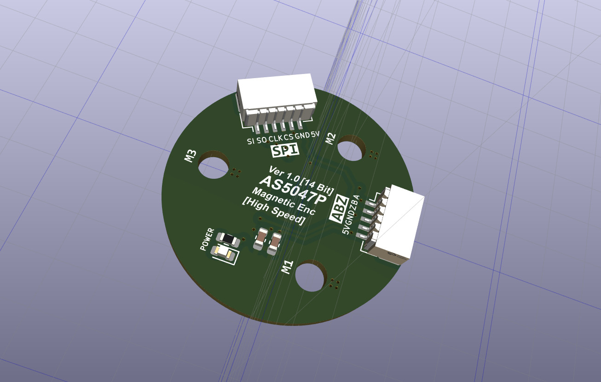

## ODriveX

一款基于 STM32F405 的高性能开源磁场定向控制（FOC）驱动器，逆变电路采用了英飞凌的 DirectFET-MOS 管，支持高达 100A 持续电流 和 3kW 电机功率，适用于机器人、无人机、CNC 等高动态应用场景。


## 核心特性

(1) 高性能功率级：英飞凌 DirectFET MOSFET，60V 耐压，单路 100A 峰值电流

(2) 多总线通信：USB-CDC、UART、RS485（Modbus RTU）、CAN 2.0B

(3) 高精度反馈：支持 AS5047P（14-bit SPI）、ABI 编码器、UVW 霍尔

(4) 现代开发栈：CMake + ARM-GCC + VSCode + OpenOCD 图形化调试

(5) 完整 FOC 控制：电流/速度/位置三闭环，支持 SVPWM、死区补偿、弱磁控制

(6) Step/Dir 兼容：可对接传统运动控制器（如 GRBL、Marlin）

## 硬件

硬件涉及两部分，驱动器主体（驱动器硬件命名为 MotorKit）和编码器模块（AS5047P-Driver）。PCB 打样使用制造输出文件（Gerber），打样时把所有 Gerber 文件压缩为 .zip 文件提供给 PCB 制造商（例如嘉立创）即可，PCB 经过我打样验证无误，Gerber 文件在 HardWare/Gerber 目录下，可直接使用。

原理图和 PCB 使用开源 EDA 工具 KiCAD 设计的，如果你有 KiCAD 也知道怎么使用，可以自己去导出 Gerber 文件。

PCB 采用 4层板设计，如果要编辑 PCB 需要下载 KiCAD，还需要看些教程熟悉使用方法，当然这个 EDA 工具本身也非常易学。

购买电子元器件按照 HardWare 目录下的 ibom.html 表格购买。

KiCAD 官方下载链接： https://www.kicad.org/

驱动器主体 KiCAD 工程目录：HardWare/kiacd_project

编码器模块 KiCAD 工程目录：HardWare/AS5047P/HardWare/kiacd_project

制造输出文件（Gerber）目录：HardWare/Gerber

器件 BOM 目录：HardWare/ibom.html

## 固件

程序固件使用 CMake 进行构建的，然后用 ARM-GCC 进行编译的，并且可以搭配 VSCode 和 OpenOCD 进行图形化调试，当然你可以新建一个 STM32F405 的 Keil 工程，把程序组织到 Keil 中编译也可以。

使用 CMake 要求会编写 CMakeLists.txt 文件，不过我这里已经编写好了，在 Firmware 目录下可以看到。

PCB 上预留了 SWD 调试接口，固件固件就可以使用 SWD 下载。

如果没有 VSCode 的嵌入式开发环境，可以看看这篇文章：https://blog.csdn.net/jf_52001760/article/details/126826393

## 电机

我购买的无刷电机是大疆精灵 3 的拆机无刷电机 2312S 可以在淘宝搜索购买，电机到手后还要进行改装，在电机轴上安装供编码器检测的径向磁铁，磁铁尺寸为 6mmx2mm，磁铁安装注意同心度不要过度偏移，磁铁与编码器的间隙大概为 1.0mm。然后再把把 AS5047 编码器模块固定到电机尾部。



## Configuration

控制参数（例如 PID，电流，速度限制等等）都是包含默认值的，所以不需要逐个配置参数电机也能正常工作起来的，必须要注意的是根据实际编码器配置 cpr（例如 AS5047P 编码器使用 ABZ 接口时 CPR 为 1000x4=4000），index 参数，根据电机配置极对数 pole pairs（例如大疆 2312s 电机的极对数为 7），以及按实际调整电流采样电阻，配置一些必须变更的即可。

什么是极对数？

极数是指电机转子（即永磁体部分）磁场中磁极的总数量，磁极总数除以 2 就是极对数，极对数用 P 表示，每个极对包含一个北磁极 N 和一个南磁极 S。

## Start-up

(1) 电机校准（实际就是测量电机的相电阻和相电感）。

(2) 搜索定位编码器 index 信号（在编码器偏移校准之前必须先搜索 index）。

(3) 编码器偏移校准（Offset 校准）。

(4) 使能闭环状态/开环状态。

(5) 设置控制模式（控制模式包含：位置模式，速度模式，电流模式）。和 (4) 结合起来就得到，位置闭环控制模式，速度闭环控制模式，电流闭环控制模式。

(6) 设置控制模式目标值（位置值，速度值，电流值）来调节电机运行状态。

(7) 电机因异常停止后清除错误重新使能进入闭环状态即可。

## Command

CAN 通信协议和 Shell 交互命令实现分别位于 [communication/can/odrive_can.cpp](communication/can/odrive_can.cpp) 和 [ThirdParty/LetterShell/src/shell_cmd_list.c](ThirdParty/LetterShell/src/shell_cmd_list.c) 文件，具体可查看这两个文件，这里列出电机运行起来必要的 Shell 指令，使用 USB 数据线线连接板子 TypeC 和 PC，在 PC 上使用串口调试助手
下发下列指令即可控制。

```cpp
设置最大负电流
odrive:/$ dc_max_negative_current "-2.0"

速度限制 50 turn/s
odrive:/$ controller_config_vel_limit 0 "50.0"

设置电机 0 进入校准状态
odrive:/$ axis_requested_state 0 3

设置电机 0 进入力矩控制模式
odrive:/$ controller_config_control_mode 0 1

设置电机 0 控制力矩
odrive:/$ controller_input_torque 0 "0.02"

进入闭环
odrive:/$ axis_requested_state 0 8

打印当前错误
odrive:/$ dump_errors 1
```

## Step/Dir

Choose any two of the unused GPIOs for step/dir input. Let’s say you chose GPIO7 for the step signal and GPIO8 for the dir signal.

选择任意两个未使用的 GPIO 即可用于 step 和 dir 信号步骤/输入，假设您选择 GPIO7 作为步长信号，GPIO8 选择用于 dir 信号。

这种是基于 step 对应 GPIO 中断对外部电平输入步数累计（中断次数累计），达到位置控制信号可以通过普通 GPIO 输入的目的，

注意这不是 PWM 输入控制模式，两者是有区别的。

This is the simplest possible way of controlling the ODrive. It is also the most primitive and fragile one. So don’t use it unless you must interoperate with other hardware that you don’t control.

这是给驱动器提供控制指令信号最简单的方法。 它也是最原始且最脆弱的一个。因此,除非必须与其他无法控制的硬件进行互操作,否则请勿使用。
